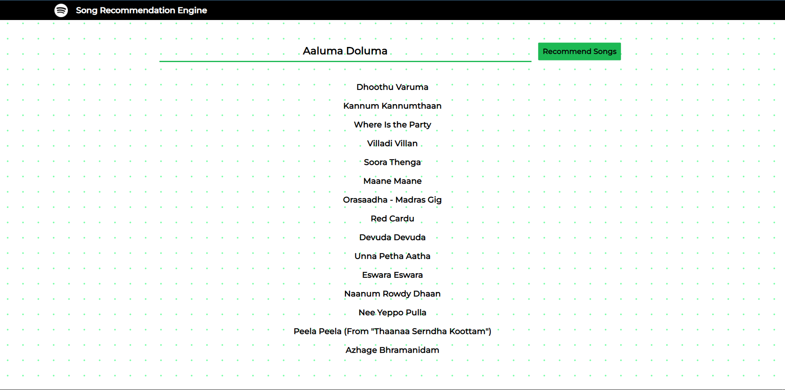
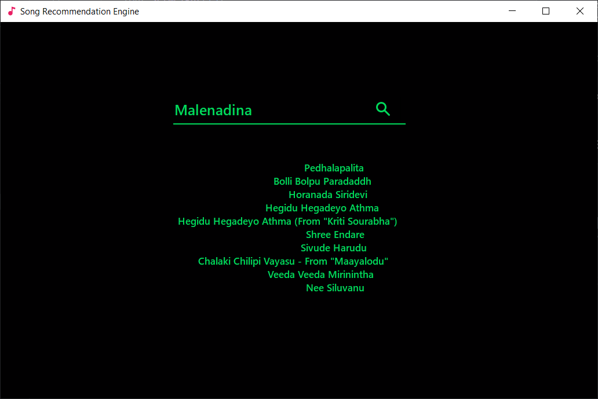

# Song Recommendation Engine using Machine Learning.

## Abstract

Recommender systems have taken the entertainment and e-commerce industries by storm. Amazon, Netflix, and Spotify are great examples. In this project, we have designed song recommendation systems using various algorithms.

We have scraped the data from the spotify using a python library called **[spotipy](https://spotipy.readthedocs.io/en/2.19.0/)** and used the data to build a recommendation model using **content based filtering** method to provide recommendations for songs based on similar songs.

1. K-Means Clustering
2. Cosine Similarity

## Dataset Description

**Acousticness** — A confidence measure from 0.0 to 1.0 of whether the track is acoustic. 1.0 represents high confidence the track is acoustic.

**Danceability** — Danceability describes how suitable a track is for dancing based on a combination of musical elements including tempo, rhythm stability, beat strength, and overall regularity. A value of 0.0 is least danceable and 1.0 is the most danceable

**Energy** — Energy is a measure from 0.0 to 1.0 and represents a perceptual measure of intensity and activity. Typically, energetic tracks feel fast, loud, and noisy.

**Loudness** — The overall loudness of a track in decibels (dB). Values typical range between -60 and 0 dB.

**Valence** — A measure from 0.0 to 1.0 describing the musical positiveness conveyed by a track. Tracks with high valence sound more positive.

**Tempo** — The overall estimated tempo of a track in beats per minute (BPM).

**Popularity** — The popularity of the track. The value will be between 0 and 100, with 100 being the most popular.

## App

1. Flask python web application.
2. pyqt5 desktop application.

## To run this project locally

Step 1: Create conda environment

```
conda create -n env_name python=3.7 -y
```

 Linux users

```
virtual env python=python3.9 env_name
```

Step 2: Clone the repo

```
git clone https://github.com/Arunprakaash/Song-Recommendation-Engine-using-Spotify-data.git
```

Step 3 : Install the requirements

```
certifi==2021.10.8
charset-normalizer==2.0.12
click==8.0.3
Flask==2.0.2
idna==3.3
itsdangerous==2.0.1
Jinja2==3.0.3
joblib==1.1.0
MarkupSafe==2.0.1
numpy==1.22.2
pandas==1.4.1
python-dateutil==2.8.2
pytz==2021.3
requests==2.27.1
scikit-learn==1.0.2
scipy==1.8.0
six==1.16.0
sklearn==0.0
spotipy==2.19.0
threadpoolctl==3.1.0
urllib3==1.26.8
Werkzeug==2.0.3
gunicorn==20.0.4
```

Step 4 : Run the app.py file

```
python app.py
```

## Screenshots

Cosine Similarity Algorithm Recommendations



K Means clustering Algorithm Recommendations



## References

https://stmorse.github.io/journal/spotify-api.html

[Welcome to Spotipy! — spotipy 2.0 documentation](https://spotipy.readthedocs.io/en/2.19.0/)

https://towardsdatascience.com/introduction-to-recommender-systems-6c66cf15ada

[Qt for Python — Qt for Python](https://doc.qt.io/qtforpython/)

[Welcome to Flask — Flask Documentation (2.0.x) (palletsprojects.com)](https://flask.palletsprojects.com/en/2.0.x/)
